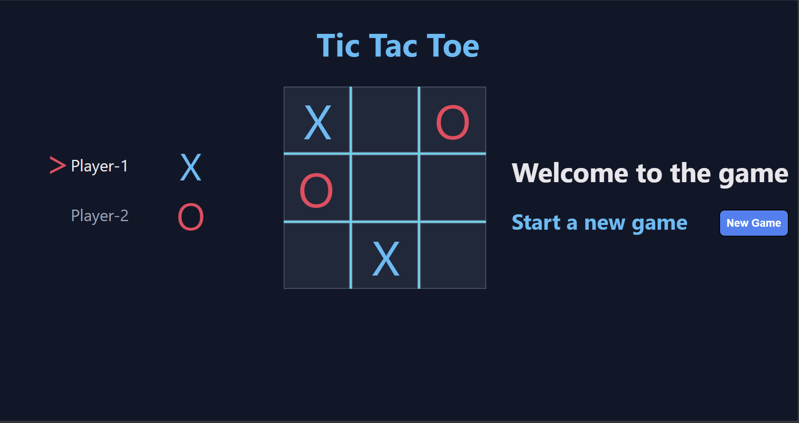

# Tic Tac Toe ❌⭕

Tic Tac Toe is a nice mini game that I enjoyed making. I use to play it sometimes when I am bored or when I want to revisit my project. I thought it would be a good side project that I can code apart from my mainstream work.

## Some Insights 👀

- I didn't use any AI in building this game. Every line of code in the game is written by me.
- The objective of this project is fun and chill while coding.
- I will keep on adding more features in the game in the future. 

